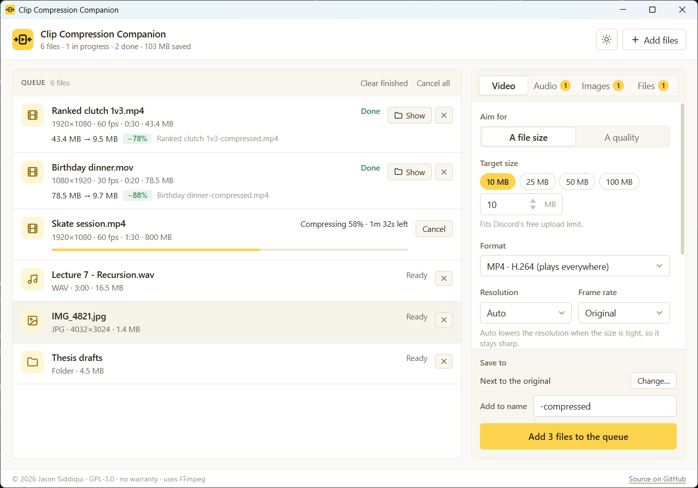
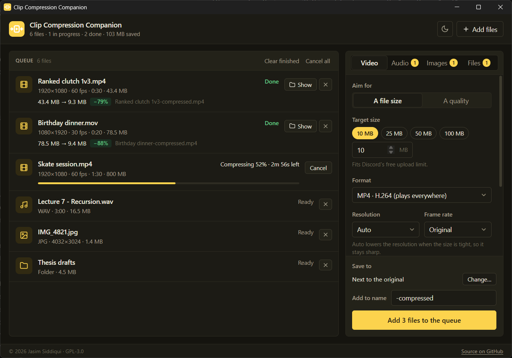

# Clip Compression Companion

**Shrink any video, song, photo, or file to the size you need, right on your own computer.**

Clip Compression Companion (CCC) is a small desktop app for the moment your
clip is 80 MB and the upload box says 10. Drop in videos, audio, images, or
anything else, pick a target size or a quality, and get a smaller copy next to
the original. It runs [FFmpeg](https://ffmpeg.org) locally, uses your graphics
card when it can, and never uploads a thing.



<details>
<summary>Dark theme</summary>



</details>

---

## The problem

Every site has a different limit: 10 MB on Discord, 25 MB for email, something
else for that one school portal. Phones record at bitrates nobody needs for a
30-second clip. Online compressors want an upload, an account, or a watermark,
and FFmpeg itself is brilliant but asks you to remember flags like
`-pass 2 -b:v 2581k`.

CCC does the math for you. Say "10 MB" and it works out the bitrate, lowers the
resolution if that's what it takes to stay sharp, and lands just under the
limit.

## Features

- **Hit an exact size**: pick 10 MB, 25 MB, 50 MB, 100 MB, or type your own. Two-pass encoding lands the file just under the target, and **Auto** resolution steps down from 1080p when the budget is tight so the picture stays clean instead of blocky.
- **Or pick a quality**: a five-step slider from *Smallest* to *Best* when you care about how it looks more than the exact size.
- **Modern formats**: H.264 (plays everywhere), H.265 (smaller), and AV1 (smallest). Frame rate, resolution, and sound are all adjustable, and sound can be removed entirely.
- **Uses your graphics card**: NVIDIA NVENC, Intel Quick Sync, and AMD AMF are detected with a real test encode, not just looked up. If the GPU ever fails mid-job, the app switches to the processor and keeps going.
- **Audio and images too**: re-encode audio to MP3, AAC, or Opus (with an optional mono mix for voice); shrink images as JPEG, WebP, or PNG, resize them, or cut PNGs down to 256 colours.
- **Anything else becomes a .zip**: documents and whole folders are packed into a standard zip that opens on any computer.
- **Your originals are safe**: every result is a new file (`clip-compressed.mp4`) next to the original or in a folder you choose. Nothing is ever overwritten, and if a result comes out *bigger* than the original it's thrown away.
- **Batch queue**: add as many files as you like, watch live progress with time remaining, cancel at any point. Half-written files are cleaned up.
- **Stays out of your way**: FFmpeg runs at below-normal priority, so the rest of your computer stays responsive, and it always stops when the app closes.
- **Light and dark**: follows your system on first launch, remembers your choice after that.
- **Drag and drop**: onto the window or onto the app's icon. `Ctrl+O` adds files, `Ctrl+Enter` starts.

## Install (Windows 10/11)

**Download page: [clipcompression.vercel.app](https://clipcompression.vercel.app/)**

No terminal, no FFmpeg install. Just download and run. Grab a build from the
download page above or straight from the
[**Releases**](https://github.com/JasimSiddiqui/clip-compression-companion/releases/latest) page:

| | What it does |
| --- | --- |
| **[`ClipCompressionCompanion-Setup.exe`](https://github.com/JasimSiddiqui/clip-compression-companion/releases/latest/download/ClipCompressionCompanion-Setup.exe)** (recommended, ~28 MB) | Double-click to install. Installs per-user (no admin prompt), adds a **Clip Compression Companion** shortcut, and adds an uninstall entry to Add/Remove Programs. |
| **[`ClipCompressionCompanion-Portable.zip`](https://github.com/JasimSiddiqui/clip-compression-companion/releases/latest/download/ClipCompressionCompanion-Portable.zip)** (~39 MB) | Unzip anywhere and run `ClipCompressionCompanion.exe`; nothing is installed. Keep `ffmpeg.exe` in the same folder. |

**First launch:** the app isn't code-signed yet, so Windows SmartScreen shows
*"Windows protected your PC."* Click **More info → Run anyway**. You only see
this once.

> Windows 11 already ships the WebView2 runtime the app needs; on Windows 10 the
> installer fetches it automatically if it's missing.

**macOS / Linux:** prebuilt downloads aren't published yet, so [build from
source](#build-from-source). The app uses the `ffmpeg` on your PATH there.

## Choosing settings

The defaults (10 MB, H.264, Auto resolution) suit most clips. If you want to
tune:

| Format | Size for the same quality | Plays on | Notes |
| --- | --- | --- | --- |
| **H.264** | baseline | Everything | **Default**. The safe choice for sharing. |
| **H.265** | ~30–40% smaller | Phones, Macs, Windows 10/11, modern browsers | A good pick when you control where it's watched. |
| **AV1** | ~40–50% smaller | Recent browsers and devices | On the processor it's slow (minutes per minute of video); with a recent graphics card it's as quick as the others. |

- **Encoding** trades time for size: *Faster* finishes sooner, *Smaller* squeezes harder. *Balanced* is the default.
- **Use the graphics card** is much faster but gives slightly lower quality for the same size. In target-size mode the file still lands under the limit.
- **Resolution → Auto** only matters in target-size mode: it picks the largest resolution the bitrate can carry well (for example 720p for a 30-second 60 fps clip at 10 MB). It never upscales.

## Build from source

You'll need [Node.js](https://nodejs.org) 18+, the
[Rust toolchain](https://rustup.rs), and the
[Tauri prerequisites](https://tauri.app/start/prerequisites/) for your OS
(on Windows: the **MSVC C++ build tools** and the **WebView2** runtime, which
ships with Windows 11).

```bash
git clone https://github.com/JasimSiddiqui/clip-compression-companion.git
cd clip-compression-companion
npm install

# Run in development (the first run downloads FFmpeg, about 100 MB)
npm run dev

# Produce an installer for your platform
npm run build

# Windows: build, then stage the installer and portable .zip in release-assets\
npm run package
```

Installers land in `src-tauri/target/release/bundle/`. On Windows, FFmpeg is the
GPL "essentials" build from [gyan.dev](https://www.gyan.dev/ffmpeg/builds/),
downloaded by [`scripts/fetch-ffmpeg.mjs`](scripts/fetch-ffmpeg.mjs); on macOS
and Linux the script copies the `ffmpeg` already on your PATH.

## How it works

CCC is a [Tauri 2](https://tauri.app) app: a small Rust core wrapped around the
system WebView, with a plain HTML/CSS/JavaScript frontend (no framework, no
bundler). FFmpeg ships beside it as a separate program.

- **Reading files** ([`src-tauri/src/media.rs`](src-tauri/src/media.rs)) uses the
  one bundled `ffmpeg` for everything: file details come from parsing the stream
  summary `ffmpeg -i` prints, so there's no `ffprobe` doubling the download. It
  also works out which encoders this machine can really use, testing each
  hardware encoder with a tiny encode in parallel at startup.
- **Compressing** ([`src-tauri/src/compress.rs`](src-tauri/src/compress.rs))
  builds the FFmpeg command for each job. For a target size it splits the byte
  budget between sound and picture, picks a resolution the bitrate can carry,
  runs two passes on the processor (one on the GPU), and if the result still
  overshoots, trims the bitrate and tries again. Progress comes from FFmpeg's
  `-progress` stream. FFmpeg runs at below-normal priority inside a Windows job
  object, so it can never outlive the app.
- **Zipping** ([`src-tauri/src/archive.rs`](src-tauri/src/archive.rs)) streams
  files into a standard Deflate `.zip` in 1 MB chunks, checking for cancel as it
  goes.
- **The frontend** ([`src/main.js`](src/main.js)) keeps the queue, sends one job
  at a time over Tauri's `invoke` bridge, and updates each row in place as
  progress events arrive. Options are snapshotted per job, so changing them
  mid-queue only affects files you add afterwards.
- **The logo** is a single SVG ([`src/assets/logo.svg`](src/assets/logo.svg)),
  used in the header and rendered into every app icon by
  [`scripts/gen-icon.mjs`](scripts/gen-icon.mjs) (`npm run icons`).

## Tech stack

- **[Tauri 2](https://tauri.app)**: desktop shell (Rust + system WebView)
- **[FFmpeg](https://ffmpeg.org)**: video, audio, and image encoding (x264, x265, libaom, NVENC, Quick Sync, AMF, LAME, Opus, libwebp)
- **Rust**: job control, file probing, and [zip](https://crates.io/crates/zip) archiving
- **Vanilla HTML/CSS/JS**: the UI, kept deliberately light

## Known limitations

- Only the first video track and first audio track are kept. Recordings with
  several audio tracks (for example OBS with separate mic and game audio) keep
  track 1, which is usually the full mix. Subtitles and chapters are dropped.
- HDR video is converted to standard 8-bit video without tone mapping, so very
  bright HDR footage can look a little washed out.
- PDFs and Office documents are only zipped, not re-compressed internally, so
  they rarely get much smaller.
- Prebuilt downloads are Windows-only for now.

## License

Copyright (C) 2026 Jasim Siddiqui.

Clip Compression Companion is free software, released under the **GNU General
Public License v3.0**. You may use, study, share, and modify it; if you
distribute a modified version, that version must also be open source under the
GPL. There is no warranty. See [LICENSE](LICENSE) for the full text.

The downloads include FFmpeg, which is © the FFmpeg developers and also licensed
under the GPL; see [`FFMPEG-NOTICE.txt`](src-tauri/FFMPEG-NOTICE.txt) for where
to get its source.
